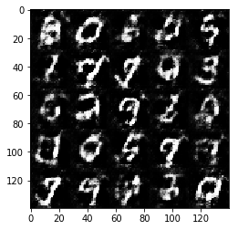
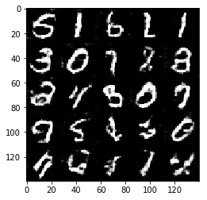
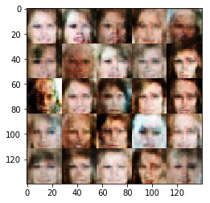

# Face Generation
In this project, you'll use generative adversarial networks to generate new images of faces.
### Get the Data
You'll be using two datasets in this project:
- MNIST
- CelebA

Since the celebA dataset is complex and you're doing GANs in a project for the first time, we want you to test your neural network on MNIST before CelebA.  Running the GANs on MNIST will allow you to see how well your model trains sooner.

If you're using [FloydHub](https://www.floydhub.com/), set `data_dir` to "/input" and use the [FloydHub data ID](http://docs.floydhub.com/home/using_datasets/) "R5KrjnANiKVhLWAkpXhNBe".


```python
data_dir = './data'

# FloydHub - Use with data ID "R5KrjnANiKVhLWAkpXhNBe"
#data_dir = '/input'


"""
DON'T MODIFY ANYTHING IN THIS CELL
"""
import helper

helper.download_extract('mnist', data_dir)
helper.download_extract('celeba', data_dir)
```

    Found mnist Data
    Found celeba Data


## Explore the Data
### MNIST
As you're aware, the [MNIST](http://yann.lecun.com/exdb/mnist/) dataset contains images of handwritten digits. You can view the first number of examples by changing `show_n_images`. 


```python
show_n_images = 25

"""
DON'T MODIFY ANYTHING IN THIS CELL
"""
%matplotlib inline
import os
from glob import glob
from matplotlib import pyplot

mnist_images = helper.get_batch(glob(os.path.join(data_dir, 'mnist/*.jpg'))[:show_n_images], 28, 28, 'L')
pyplot.imshow(helper.images_square_grid(mnist_images, 'L'), cmap='gray')
```


    <matplotlib.image.AxesImage at 0x7f920011a3c8>


    

    


### CelebA
The [CelebFaces Attributes Dataset (CelebA)](http://mmlab.ie.cuhk.edu.hk/projects/CelebA.html) dataset contains over 200,000 celebrity images with annotations.  Since you're going to be generating faces, you won't need the annotations.  You can view the first number of examples by changing `show_n_images`.


```python
show_n_images = 25

"""
DON'T MODIFY ANYTHING IN THIS CELL
"""
mnist_images = helper.get_batch(glob(os.path.join(data_dir, 'img_align_celeba/*.jpg'))[:show_n_images], 28, 28, 'RGB')
pyplot.imshow(helper.images_square_grid(mnist_images, 'RGB'))
```


    <matplotlib.image.AxesImage at 0x7f9200041f60>


    

    


## Preprocess the Data
Since the project's main focus is on building the GANs, we'll preprocess the data for you.  The values of the MNIST and CelebA dataset will be in the range of -0.5 to 0.5 of 28x28 dimensional images.  The CelebA images will be cropped to remove parts of the image that don't include a face, then resized down to 28x28.

The MNIST images are black and white images with a single [color channel](https://en.wikipedia.org/wiki/Channel_(digital_image%29) while the CelebA images have [3 color channels (RGB color channel)](https://en.wikipedia.org/wiki/Channel_(digital_image%29#RGB_Images).
## Build the Neural Network
You'll build the components necessary to build a GANs by implementing the following functions below:
- `model_inputs`
- `discriminator`
- `generator`
- `model_loss`
- `model_opt`
- `train`

### Check the Version of TensorFlow and Access to GPU
This will check to make sure you have the correct version of TensorFlow and access to a GPU


```python
"""
DON'T MODIFY ANYTHING IN THIS CELL
"""
from distutils.version import LooseVersion
import warnings
import tensorflow as tf

# Check TensorFlow Version
assert LooseVersion(tf.__version__) >= LooseVersion('1.0'), 'Please use TensorFlow version 1.0 or newer.  You are using {}'.format(tf.__version__)
print('TensorFlow Version: {}'.format(tf.__version__))

# Check for a GPU
if not tf.test.gpu_device_name():
    warnings.warn('No GPU found. Please use a GPU to train your neural network.')
else:
    print('Default GPU Device: {}'.format(tf.test.gpu_device_name()))
```

    TensorFlow Version: 1.0.0
    Default GPU Device: /gpu:0


### Input
Implement the `model_inputs` function to create TF Placeholders for the Neural Network. It should create the following placeholders:
- Real input images placeholder with rank 4 using `image_width`, `image_height`, and `image_channels`.
- Z input placeholder with rank 2 using `z_dim`.
- Learning rate placeholder with rank 0.

Return the placeholders in the following the tuple (tensor of real input images, tensor of z data)


```python
import problem_unittests as tests

def model_inputs(image_width, image_height, image_channels, z_dim):
    """
    Create the model inputs
    :param image_width: The input image width
    :param image_height: The input image height
    :param image_channels: The number of image channels
    :param z_dim: The dimension of Z
    :return: Tuple of (tensor of real input images, tensor of z data, learning rate)
    """
    # TODO: Implement Function
    
    inputs_real = tf.placeholder(tf.float32, (None, image_height, image_width, image_channels), name='input_real')
    inputs_z = tf.placeholder(tf.float32, (None, z_dim), name='input_z')
    learning_rate = tf.placeholder(tf.float32, name='learning_rate')
    return inputs_real, inputs_z, learning_rate


"""
DON'T MODIFY ANYTHING IN THIS CELL THAT IS BELOW THIS LINE
"""
tests.test_model_inputs(model_inputs)
```

    Tests Passed


### Discriminator
Implement `discriminator` to create a discriminator neural network that discriminates on `images`.  This function should be able to reuse the variabes in the neural network.  Use [`tf.variable_scope`](https://www.tensorflow.org/api_docs/python/tf/variable_scope) with a scope name of "discriminator" to allow the variables to be reused.  The function should return a tuple of (tensor output of the generator, tensor logits of the generator).


```python
def discriminator(images, reuse=False):
    """
    Create the discriminator network
    :param image: Tensor of input image(s)
    :param reuse: Boolean if the weights should be reused
    :return: Tuple of (tensor output of the discriminator, tensor logits of the discriminator)
    """
    # TODO: Implement Function

    with tf.variable_scope('discriminator', reuse=reuse) as discriminator_scope:
        alpha = 0.2
        x1 = tf.layers.conv2d(images, 64, 5, strides=2, padding='same')
        relu1 = tf.maximum(alpha * x1, x1)
        
        x2 = tf.layers.conv2d(relu1, 128, 5, strides=2, padding='same')
        bn2 = tf.layers.batch_normalization(x2, training=True)
        relu2 = tf.maximum(alpha * bn2, bn2)
        
        x3 = tf.layers.conv2d(relu2, 256, 5, strides=2, padding='same')
        bn3 = tf.layers.batch_normalization(x3, training=True)
        relu3 = tf.maximum(alpha * bn3, bn3)

        flat = tf.reshape(relu3, (-1, 4*4*256))
        logits = tf.layers.dense(flat, 1)
        out = tf.sigmoid(logits)
        
        return out, logits
    

"""
DON'T MODIFY ANYTHING IN THIS CELL THAT IS BELOW THIS LINE
"""
tests.test_discriminator(discriminator, tf)
```

    Tests Passed


### Generator
Implement `generator` to generate an image using `z`. This function should be able to reuse the variabes in the neural network.  Use [`tf.variable_scope`](https://www.tensorflow.org/api_docs/python/tf/variable_scope) with a scope name of "generator" to allow the variables to be reused. The function should return the generated 28 x 28 x `out_channel_dim` images.


```python
def generator(z, out_channel_dim, is_train=True):
    """
    Create the generator network
    :param z: Input z
    :param out_channel_dim: The number of channels in the output image
    :param is_train: Boolean if generator is being used for training
    :return: The tensor output of the generator
    """
    # TODO: Implement Function
    
    reuse = not is_train
    alpha = 0.2

    with tf.variable_scope('generator', reuse=reuse):
        x1 = tf.layers.dense(z, 2*2*512)

        x1 = tf.reshape(x1, (-1, 2, 2, 512))
        x1 = tf.layers.batch_normalization(x1, training=is_train)
        x1 = tf.maximum(alpha * x1, x1)
        
        x2 = tf.layers.conv2d_transpose(x1, 256, 5, strides=2, padding='valid')
        x2 = tf.layers.batch_normalization(x2, training=is_train)
        x2 = tf.maximum(alpha * x2, x2)
        
        x3 = tf.layers.conv2d_transpose(x2, 128, 5, strides=2, padding='same')
        x3 = tf.layers.batch_normalization(x3, training=is_train)
        x3 = tf.maximum(alpha * x3, x3)

        logits = tf.layers.conv2d_transpose(x3, out_channel_dim, 5, strides=2, padding='same')
        
        out = tf.tanh(logits)
        
        return out


"""
DON'T MODIFY ANYTHING IN THIS CELL THAT IS BELOW THIS LINE
"""
tests.test_generator(generator, tf)
```

    Tests Passed


### Loss
Implement `model_loss` to build the GANs for training and calculate the loss.  The function should return a tuple of (discriminator loss, generator loss).  Use the following functions you implemented:
- `discriminator(images, reuse=False)`
- `generator(z, out_channel_dim, is_train=True)`


```python
def model_loss(input_real, input_z, out_channel_dim):
    """
    Get the loss for the discriminator and generator
    :param input_real: Images from the real dataset
    :param input_z: Z input
    :param out_channel_dim: The number of channels in the output image
    :return: A tuple of (discriminator loss, generator loss)
    """
    # TODO: Implement Function
    
    g_model = generator(input_z, out_channel_dim)
    d_model_real, d_logits_real = discriminator(input_real)
    d_model_fake, d_logits_fake = discriminator(g_model, reuse=True)

    d_loss_real = tf.reduce_mean(
        tf.nn.sigmoid_cross_entropy_with_logits(logits=d_logits_real, labels=tf.ones_like(d_model_real)))
    d_loss_fake = tf.reduce_mean(
        tf.nn.sigmoid_cross_entropy_with_logits(logits=d_logits_fake, labels=tf.zeros_like(d_model_fake)))
    d_loss = d_loss_real + d_loss_fake
    
    g_loss = tf.reduce_mean(
        tf.nn.sigmoid_cross_entropy_with_logits(logits=d_logits_fake, labels=tf.ones_like(d_model_fake)))

    return d_loss, g_loss


"""
DON'T MODIFY ANYTHING IN THIS CELL THAT IS BELOW THIS LINE
"""
tests.test_model_loss(model_loss)
```

    Tests Passed


### Optimization
Implement `model_opt` to create the optimization operations for the GANs. Use [`tf.trainable_variables`](https://www.tensorflow.org/api_docs/python/tf/trainable_variables) to get all the trainable variables.  Filter the variables with names that are in the discriminator and generator scope names.  The function should return a tuple of (discriminator training operation, generator training operation).


```python
def model_opt(d_loss, g_loss, learning_rate, beta1):
    """
    Get optimization operations
    :param d_loss: Discriminator loss Tensor
    :param g_loss: Generator loss Tensor
    :param learning_rate: Learning Rate Placeholder
    :param beta1: The exponential decay rate for the 1st moment in the optimizer
    :return: A tuple of (discriminator training operation, generator training operation)
    """
    # TODO: Implement Function
    
    t_vars = tf.trainable_variables()
    d_vars = [var for var in t_vars if var.name.startswith('discriminator')]
    g_vars = [var for var in t_vars if var.name.startswith('generator')]
    
    with tf.control_dependencies(tf.get_collection(tf.GraphKeys.UPDATE_OPS)):
        d_train_opt = tf.train.AdamOptimizer(learning_rate, beta1=beta1).minimize(d_loss, var_list=d_vars)
        g_train_opt = tf.train.AdamOptimizer(learning_rate, beta1=beta1).minimize(g_loss, var_list=g_vars)

    return d_train_opt, g_train_opt

"""
DON'T MODIFY ANYTHING IN THIS CELL THAT IS BELOW THIS LINE
"""
tests.test_model_opt(model_opt, tf)
```

    Tests Passed


## Neural Network Training
### Show Output
Use this function to show the current output of the generator during training. It will help you determine how well the GANs is training.


```python
"""
DON'T MODIFY ANYTHING IN THIS CELL
"""
import numpy as np

def show_generator_output(sess, n_images, input_z, out_channel_dim, image_mode):
    """
    Show example output for the generator
    :param sess: TensorFlow session
    :param n_images: Number of Images to display
    :param input_z: Input Z Tensor
    :param out_channel_dim: The number of channels in the output image
    :param image_mode: The mode to use for images ("RGB" or "L")
    """
    cmap = None if image_mode == 'RGB' else 'gray'
    z_dim = input_z.get_shape().as_list()[-1]
    example_z = np.random.uniform(-1, 1, size=[n_images, z_dim])

    samples = sess.run(
        generator(input_z, out_channel_dim, False),
        feed_dict={input_z: example_z})

    images_grid = helper.images_square_grid(samples, image_mode)
    pyplot.imshow(images_grid, cmap=cmap)
    pyplot.show()
```

### Train
Implement `train` to build and train the GANs.  Use the following functions you implemented:
- `model_inputs(image_width, image_height, image_channels, z_dim)`
- `model_loss(input_real, input_z, out_channel_dim)`
- `model_opt(d_loss, g_loss, learning_rate, beta1)`

Use the `show_generator_output` to show `generator` output while you train. Running `show_generator_output` for every batch will drastically increase training time and increase the size of the notebook.  It's recommended to print the `generator` output every 100 batches.


```python
def train(epoch_count, batch_size, z_dim, learning_rate, beta1, get_batches, data_shape, data_image_mode):
    """
    Train the GAN
    :param epoch_count: Number of epochs
    :param batch_size: Batch Size
    :param z_dim: Z dimension
    :param learning_rate: Learning Rate
    :param beta1: The exponential decay rate for the 1st moment in the optimizer
    :param get_batches: Function to get batches
    :param data_shape: Shape of the data
    :param data_image_mode: The image mode to use for images ("RGB" or "L")
    """
    # TODO: Build Model
    
    sample_z = np.random.uniform(-1, 1, size=(50, z_dim))
    samples, losses = [], []
    steps, print_every = 0, 100

    # Inputs
    input_real, input_z, lr = model_inputs(data_shape[1], data_shape[2], data_shape[3], z_dim)

    # Loss
    d_loss, g_loss = model_loss(input_real, input_z, data_shape[3])

    # Optimizers
    d_opt, g_opt = model_opt(d_loss, g_loss, learning_rate, beta1)

    with tf.Session() as sess:
        sess.run(tf.global_variables_initializer())
        for epoch_i in range(epoch_count):
            for batch_images in get_batches(batch_size):
                # TODO: Train Model
                steps += 1

                batch_z = np.random.uniform(-1, 1, size=(batch_size, z_dim))
                batch_images = batch_images * 2

                sess.run(d_opt, feed_dict={input_real:batch_images, input_z: batch_z, lr:learning_rate})
                sess.run(g_opt, feed_dict={input_real:batch_images, input_z: batch_z})
                sess.run(g_opt, feed_dict={input_real:batch_images, input_z: batch_z})
                sess.run(g_opt, feed_dict={input_real:batch_images, input_z: batch_z})

                if steps % 10 == 0:
                # At the end of each epoch, get the losses and print them out
                    train_loss_d = d_loss.eval({input_z: batch_z, input_real: batch_images})
                    train_loss_g = g_loss.eval({input_z: batch_z})

                    print("Epoch {}/{}...".format(epoch_i+1, epochs),
                          "Discriminator Loss: {:.4f}...".format(train_loss_d),
                          "Generator Loss: {:.4f}".format(train_loss_g))
                    losses.append((train_loss_d, train_loss_g))

                if steps % 100 == 0:
                    gen_samples = sess.run(
                                   generator(input_z, data_shape[3], is_train=False),
                                   feed_dict={input_z: sample_z})
                    samples.append(gen_samples)
                    show_generator_output(sess, 25, input_z, data_shape[3], data_image_mode)


                
```

### MNIST
Test your GANs architecture on MNIST.  After 2 epochs, the GANs should be able to generate images that look like handwritten digits.  Make sure the loss of the generator is lower than the loss of the discriminator or close to 0.


```python
batch_size = 64
z_dim = 100
learning_rate = 0.001
beta1 = 0.25


"""
DON'T MODIFY ANYTHING IN THIS CELL THAT IS BELOW THIS LINE
"""
epochs = 2

mnist_dataset = helper.Dataset('mnist', glob(os.path.join(data_dir, 'mnist/*.jpg')))
with tf.Graph().as_default():
    train(epochs, batch_size, z_dim, learning_rate, beta1, mnist_dataset.get_batches,
          mnist_dataset.shape, mnist_dataset.image_mode)
```

    Epoch 1/2... Discriminator Loss: 3.5075... Generator Loss: 1.5789
    Epoch 1/2... Discriminator Loss: 2.7045... Generator Loss: 0.1692
    Epoch 1/2... Discriminator Loss: 2.2003... Generator Loss: 0.1514
    Epoch 1/2... Discriminator Loss: 2.4514... Generator Loss: 0.2640
    Epoch 1/2... Discriminator Loss: 1.7685... Generator Loss: 0.4259
    Epoch 1/2... Discriminator Loss: 1.4084... Generator Loss: 0.6326
    Epoch 1/2... Discriminator Loss: 1.4883... Generator Loss: 0.5159
    Epoch 1/2... Discriminator Loss: 1.5026... Generator Loss: 0.7341
    Epoch 1/2... Discriminator Loss: 1.6446... Generator Loss: 0.8373
    Epoch 1/2... Discriminator Loss: 1.6137... Generator Loss: 0.6087


    

    


    Epoch 1/2... Discriminator Loss: 1.8393... Generator Loss: 1.2161
    Epoch 1/2... Discriminator Loss: 1.7465... Generator Loss: 0.6270
    Epoch 1/2... Discriminator Loss: 1.6267... Generator Loss: 1.0420
    Epoch 1/2... Discriminator Loss: 1.5984... Generator Loss: 0.9426
    Epoch 1/2... Discriminator Loss: 1.5247... Generator Loss: 0.7931
    Epoch 1/2... Discriminator Loss: 1.5279... Generator Loss: 0.6298
    Epoch 1/2... Discriminator Loss: 1.5561... Generator Loss: 0.8815
    Epoch 1/2... Discriminator Loss: 1.6792... Generator Loss: 1.1629
    Epoch 1/2... Discriminator Loss: 1.5820... Generator Loss: 0.9547
    Epoch 1/2... Discriminator Loss: 1.4686... Generator Loss: 0.7532


    

    


    Epoch 1/2... Discriminator Loss: 1.6077... Generator Loss: 1.0849
    Epoch 1/2... Discriminator Loss: 1.5145... Generator Loss: 0.9743
    Epoch 1/2... Discriminator Loss: 1.5395... Generator Loss: 0.9666
    Epoch 1/2... Discriminator Loss: 1.5214... Generator Loss: 0.9316
    Epoch 1/2... Discriminator Loss: 1.4655... Generator Loss: 0.9059
    Epoch 1/2... Discriminator Loss: 1.4802... Generator Loss: 0.9089
    Epoch 1/2... Discriminator Loss: 1.5043... Generator Loss: 0.9933
    Epoch 1/2... Discriminator Loss: 1.5188... Generator Loss: 0.8761
    Epoch 1/2... Discriminator Loss: 1.5376... Generator Loss: 1.0760
    Epoch 1/2... Discriminator Loss: 1.5035... Generator Loss: 0.8442


    

    


    Epoch 1/2... Discriminator Loss: 1.5177... Generator Loss: 1.0128
    Epoch 1/2... Discriminator Loss: 1.5209... Generator Loss: 0.9201
    Epoch 1/2... Discriminator Loss: 1.4731... Generator Loss: 0.9764
    Epoch 1/2... Discriminator Loss: 1.5052... Generator Loss: 0.7740
    Epoch 1/2... Discriminator Loss: 1.5319... Generator Loss: 0.9300
    Epoch 1/2... Discriminator Loss: 1.4289... Generator Loss: 0.7427
    Epoch 1/2... Discriminator Loss: 1.5809... Generator Loss: 1.0307
    Epoch 1/2... Discriminator Loss: 1.5564... Generator Loss: 1.0514
    Epoch 1/2... Discriminator Loss: 1.5218... Generator Loss: 0.8213
    Epoch 1/2... Discriminator Loss: 1.4983... Generator Loss: 0.8925


    

    


    Epoch 1/2... Discriminator Loss: 1.4626... Generator Loss: 0.9290
    Epoch 1/2... Discriminator Loss: 1.4780... Generator Loss: 0.8866
    Epoch 1/2... Discriminator Loss: 1.4923... Generator Loss: 0.8806
    Epoch 1/2... Discriminator Loss: 1.5437... Generator Loss: 0.9913
    Epoch 1/2... Discriminator Loss: 1.4685... Generator Loss: 0.9559
    Epoch 1/2... Discriminator Loss: 1.4818... Generator Loss: 0.8821
    Epoch 1/2... Discriminator Loss: 1.5011... Generator Loss: 0.9316
    Epoch 1/2... Discriminator Loss: 1.4621... Generator Loss: 0.8607
    Epoch 1/2... Discriminator Loss: 1.5167... Generator Loss: 0.9333
    Epoch 1/2... Discriminator Loss: 1.5244... Generator Loss: 0.9172


    

    


    Epoch 1/2... Discriminator Loss: 1.5175... Generator Loss: 0.8733
    Epoch 1/2... Discriminator Loss: 1.5016... Generator Loss: 1.0099
    Epoch 1/2... Discriminator Loss: 1.4821... Generator Loss: 0.7874
    Epoch 1/2... Discriminator Loss: 1.4666... Generator Loss: 0.9977
    Epoch 1/2... Discriminator Loss: 1.5442... Generator Loss: 0.9920
    Epoch 1/2... Discriminator Loss: 1.4830... Generator Loss: 0.8404
    Epoch 1/2... Discriminator Loss: 1.5390... Generator Loss: 0.9324
    Epoch 1/2... Discriminator Loss: 1.4712... Generator Loss: 0.9022
    Epoch 1/2... Discriminator Loss: 1.4840... Generator Loss: 0.8993
    Epoch 1/2... Discriminator Loss: 1.4796... Generator Loss: 0.8957


    

    


    Epoch 1/2... Discriminator Loss: 1.4986... Generator Loss: 0.9778
    Epoch 1/2... Discriminator Loss: 1.5025... Generator Loss: 0.9171
    Epoch 1/2... Discriminator Loss: 1.4951... Generator Loss: 0.9709
    Epoch 1/2... Discriminator Loss: 1.4869... Generator Loss: 0.8326
    Epoch 1/2... Discriminator Loss: 1.4884... Generator Loss: 0.8656
    Epoch 1/2... Discriminator Loss: 1.5033... Generator Loss: 1.0048
    Epoch 1/2... Discriminator Loss: 1.5586... Generator Loss: 1.0225
    Epoch 1/2... Discriminator Loss: 1.4997... Generator Loss: 0.8383
    Epoch 1/2... Discriminator Loss: 1.4240... Generator Loss: 0.7934
    Epoch 1/2... Discriminator Loss: 1.4188... Generator Loss: 0.8824


    

    


    Epoch 1/2... Discriminator Loss: 1.5437... Generator Loss: 1.0285
    Epoch 1/2... Discriminator Loss: 1.5095... Generator Loss: 0.8889
    Epoch 1/2... Discriminator Loss: 1.4815... Generator Loss: 0.9791
    Epoch 1/2... Discriminator Loss: 1.5728... Generator Loss: 0.9707
    Epoch 1/2... Discriminator Loss: 1.5412... Generator Loss: 0.9977
    Epoch 1/2... Discriminator Loss: 1.4908... Generator Loss: 0.7848
    Epoch 1/2... Discriminator Loss: 1.6528... Generator Loss: 1.1871
    Epoch 1/2... Discriminator Loss: 1.4507... Generator Loss: 0.8761
    Epoch 1/2... Discriminator Loss: 1.5028... Generator Loss: 0.9449
    Epoch 1/2... Discriminator Loss: 1.6671... Generator Loss: 1.2061


    

    


    Epoch 1/2... Discriminator Loss: 1.4289... Generator Loss: 0.6666
    Epoch 1/2... Discriminator Loss: 1.6661... Generator Loss: 1.1651
    Epoch 1/2... Discriminator Loss: 1.4318... Generator Loss: 0.8126
    Epoch 1/2... Discriminator Loss: 1.5211... Generator Loss: 0.8587
    Epoch 1/2... Discriminator Loss: 1.5316... Generator Loss: 0.9623
    Epoch 1/2... Discriminator Loss: 1.4554... Generator Loss: 0.8897
    Epoch 1/2... Discriminator Loss: 1.5077... Generator Loss: 0.9090
    Epoch 1/2... Discriminator Loss: 1.5377... Generator Loss: 0.9726
    Epoch 1/2... Discriminator Loss: 1.5160... Generator Loss: 0.8839
    Epoch 1/2... Discriminator Loss: 1.4524... Generator Loss: 0.8228


    

    


    Epoch 1/2... Discriminator Loss: 1.6129... Generator Loss: 1.0614
    Epoch 1/2... Discriminator Loss: 1.4576... Generator Loss: 0.7933
    Epoch 1/2... Discriminator Loss: 1.5012... Generator Loss: 0.9655
    Epoch 2/2... Discriminator Loss: 1.5461... Generator Loss: 0.9410
    Epoch 2/2... Discriminator Loss: 1.4859... Generator Loss: 0.8006
    Epoch 2/2... Discriminator Loss: 1.4655... Generator Loss: 0.6772
    Epoch 2/2... Discriminator Loss: 1.5823... Generator Loss: 0.9959
    Epoch 2/2... Discriminator Loss: 1.5957... Generator Loss: 0.8756
    Epoch 2/2... Discriminator Loss: 1.5392... Generator Loss: 0.8036
    Epoch 2/2... Discriminator Loss: 1.4505... Generator Loss: 0.7553


    

    


    Epoch 2/2... Discriminator Loss: 1.7092... Generator Loss: 0.9983
    Epoch 2/2... Discriminator Loss: 1.4708... Generator Loss: 0.6418
    Epoch 2/2... Discriminator Loss: 1.4588... Generator Loss: 0.5669
    Epoch 2/2... Discriminator Loss: 2.0158... Generator Loss: 0.1902
    Epoch 2/2... Discriminator Loss: 1.4448... Generator Loss: 0.5337
    Epoch 2/2... Discriminator Loss: 1.4601... Generator Loss: 0.5473
    Epoch 2/2... Discriminator Loss: 1.5562... Generator Loss: 0.3684
    Epoch 2/2... Discriminator Loss: 1.6637... Generator Loss: 0.2948
    Epoch 2/2... Discriminator Loss: 1.4466... Generator Loss: 0.5203
    Epoch 2/2... Discriminator Loss: 1.5551... Generator Loss: 0.4121


    

    


    Epoch 2/2... Discriminator Loss: 1.6973... Generator Loss: 0.2923
    Epoch 2/2... Discriminator Loss: 1.4342... Generator Loss: 0.6896
    Epoch 2/2... Discriminator Loss: 1.4317... Generator Loss: 0.5604
    Epoch 2/2... Discriminator Loss: 1.8025... Generator Loss: 0.2374
    Epoch 2/2... Discriminator Loss: 1.5674... Generator Loss: 0.3864
    Epoch 2/2... Discriminator Loss: 1.5130... Generator Loss: 0.4674
    Epoch 2/2... Discriminator Loss: 1.5555... Generator Loss: 0.3806
    Epoch 2/2... Discriminator Loss: 1.5421... Generator Loss: 0.3809
    Epoch 2/2... Discriminator Loss: 1.5626... Generator Loss: 0.3757
    Epoch 2/2... Discriminator Loss: 1.6858... Generator Loss: 0.2897


    

    


    Epoch 2/2... Discriminator Loss: 1.3951... Generator Loss: 0.7785
    Epoch 2/2... Discriminator Loss: 1.4376... Generator Loss: 0.6702
    Epoch 2/2... Discriminator Loss: 1.4315... Generator Loss: 0.6708
    Epoch 2/2... Discriminator Loss: 1.5350... Generator Loss: 0.4007
    Epoch 2/2... Discriminator Loss: 1.5841... Generator Loss: 0.3591
    Epoch 2/2... Discriminator Loss: 1.5925... Generator Loss: 0.3491
    Epoch 2/2... Discriminator Loss: 1.4376... Generator Loss: 0.4725
    Epoch 2/2... Discriminator Loss: 1.4571... Generator Loss: 0.4948
    Epoch 2/2... Discriminator Loss: 1.3557... Generator Loss: 0.6630
    Epoch 2/2... Discriminator Loss: 1.4859... Generator Loss: 0.9427


    

    


    Epoch 2/2... Discriminator Loss: 1.3356... Generator Loss: 0.8496
    Epoch 2/2... Discriminator Loss: 1.5667... Generator Loss: 0.9383
    Epoch 2/2... Discriminator Loss: 1.4553... Generator Loss: 0.5752
    Epoch 2/2... Discriminator Loss: 1.5461... Generator Loss: 0.9726
    Epoch 2/2... Discriminator Loss: 1.4260... Generator Loss: 0.9672
    Epoch 2/2... Discriminator Loss: 1.4336... Generator Loss: 0.6823
    Epoch 2/2... Discriminator Loss: 1.4906... Generator Loss: 0.5322
    Epoch 2/2... Discriminator Loss: 1.4107... Generator Loss: 0.5757
    Epoch 2/2... Discriminator Loss: 1.4883... Generator Loss: 0.8062
    Epoch 2/2... Discriminator Loss: 1.5108... Generator Loss: 1.0033


    

    


    Epoch 2/2... Discriminator Loss: 1.4107... Generator Loss: 0.7552
    Epoch 2/2... Discriminator Loss: 1.4737... Generator Loss: 0.8223
    Epoch 2/2... Discriminator Loss: 1.4677... Generator Loss: 0.8484
    Epoch 2/2... Discriminator Loss: 1.5159... Generator Loss: 0.6205
    Epoch 2/2... Discriminator Loss: 1.3897... Generator Loss: 0.6143
    Epoch 2/2... Discriminator Loss: 1.6543... Generator Loss: 0.3175
    Epoch 2/2... Discriminator Loss: 1.4223... Generator Loss: 0.4507
    Epoch 2/2... Discriminator Loss: 1.4602... Generator Loss: 0.4891
    Epoch 2/2... Discriminator Loss: 1.4427... Generator Loss: 0.5432
    Epoch 2/2... Discriminator Loss: 2.6819... Generator Loss: 1.8710


    

    


    Epoch 2/2... Discriminator Loss: 1.5157... Generator Loss: 0.5765
    Epoch 2/2... Discriminator Loss: 1.4997... Generator Loss: 0.5202
    Epoch 2/2... Discriminator Loss: 1.4877... Generator Loss: 0.5176
    Epoch 2/2... Discriminator Loss: 1.4530... Generator Loss: 0.7823
    Epoch 2/2... Discriminator Loss: 1.5882... Generator Loss: 0.3335
    Epoch 2/2... Discriminator Loss: 1.5741... Generator Loss: 0.3850
    Epoch 2/2... Discriminator Loss: 1.8097... Generator Loss: 0.2487
    Epoch 2/2... Discriminator Loss: 1.5764... Generator Loss: 0.3444
    Epoch 2/2... Discriminator Loss: 1.5038... Generator Loss: 0.4751
    Epoch 2/2... Discriminator Loss: 1.6219... Generator Loss: 0.3149


    

    


    Epoch 2/2... Discriminator Loss: 1.7681... Generator Loss: 0.2667
    Epoch 2/2... Discriminator Loss: 1.6025... Generator Loss: 0.3490
    Epoch 2/2... Discriminator Loss: 1.4758... Generator Loss: 0.4551
    Epoch 2/2... Discriminator Loss: 1.3403... Generator Loss: 0.5337
    Epoch 2/2... Discriminator Loss: 2.0633... Generator Loss: 0.1686
    Epoch 2/2... Discriminator Loss: 1.5028... Generator Loss: 0.6162
    Epoch 2/2... Discriminator Loss: 1.7385... Generator Loss: 1.0201
    Epoch 2/2... Discriminator Loss: 1.3733... Generator Loss: 0.7472
    Epoch 2/2... Discriminator Loss: 1.7599... Generator Loss: 0.2700
    Epoch 2/2... Discriminator Loss: 1.5585... Generator Loss: 0.3567


    

    


    Epoch 2/2... Discriminator Loss: 2.9715... Generator Loss: 2.0724
    Epoch 2/2... Discriminator Loss: 1.3893... Generator Loss: 0.6300
    Epoch 2/2... Discriminator Loss: 1.3739... Generator Loss: 0.6877
    Epoch 2/2... Discriminator Loss: 1.6255... Generator Loss: 1.1373
    Epoch 2/2... Discriminator Loss: 1.2448... Generator Loss: 0.8396
    Epoch 2/2... Discriminator Loss: 1.5592... Generator Loss: 1.1811
    Epoch 2/2... Discriminator Loss: 1.3562... Generator Loss: 0.5814
    Epoch 2/2... Discriminator Loss: 1.4433... Generator Loss: 0.5570
    Epoch 2/2... Discriminator Loss: 1.3554... Generator Loss: 0.5802
    Epoch 2/2... Discriminator Loss: 1.4518... Generator Loss: 0.5277


    

    


    Epoch 2/2... Discriminator Loss: 1.5837... Generator Loss: 0.3773
    Epoch 2/2... Discriminator Loss: 1.6346... Generator Loss: 0.2939
    Epoch 2/2... Discriminator Loss: 1.5459... Generator Loss: 0.3547
    Epoch 2/2... Discriminator Loss: 1.8168... Generator Loss: 0.2496
    Epoch 2/2... Discriminator Loss: 1.7049... Generator Loss: 1.1520
    Epoch 2/2... Discriminator Loss: 1.4014... Generator Loss: 1.1358
    Epoch 2/2... Discriminator Loss: 1.5564... Generator Loss: 0.5794


### CelebA
Run your GANs on CelebA.  It will take around 20 minutes on the average GPU to run one epoch.  You can run the whole epoch or stop when it starts to generate realistic faces.


```python
batch_size = 64
z_dim = 100
learning_rate = 0.001
beta1 = 0.25


"""
DON'T MODIFY ANYTHING IN THIS CELL THAT IS BELOW THIS LINE
"""
epochs = 1

celeba_dataset = helper.Dataset('celeba', glob(os.path.join(data_dir, 'img_align_celeba/*.jpg')))
with tf.Graph().as_default():
    train(epochs, batch_size, z_dim, learning_rate, beta1, celeba_dataset.get_batches,
          celeba_dataset.shape, celeba_dataset.image_mode)
```

    Epoch 1/1... Discriminator Loss: 3.8354... Generator Loss: 0.6563
    Epoch 1/1... Discriminator Loss: 1.9259... Generator Loss: 0.3126
    Epoch 1/1... Discriminator Loss: 2.0801... Generator Loss: 0.4085
    Epoch 1/1... Discriminator Loss: 1.6015... Generator Loss: 0.6460
    Epoch 1/1... Discriminator Loss: 1.9220... Generator Loss: 0.4178
    Epoch 1/1... Discriminator Loss: 1.6650... Generator Loss: 0.6507
    Epoch 1/1... Discriminator Loss: 1.6451... Generator Loss: 0.4212
    Epoch 1/1... Discriminator Loss: 1.6290... Generator Loss: 0.6001
    Epoch 1/1... Discriminator Loss: 1.6356... Generator Loss: 0.7540
    Epoch 1/1... Discriminator Loss: 1.8184... Generator Loss: 0.4466


    

    


    Epoch 1/1... Discriminator Loss: 1.6564... Generator Loss: 0.4799
    Epoch 1/1... Discriminator Loss: 1.5593... Generator Loss: 0.7170
    Epoch 1/1... Discriminator Loss: 1.5555... Generator Loss: 0.5265
    Epoch 1/1... Discriminator Loss: 1.5677... Generator Loss: 0.5588
    Epoch 1/1... Discriminator Loss: 1.5917... Generator Loss: 0.5453
    Epoch 1/1... Discriminator Loss: 1.7004... Generator Loss: 0.4581
    Epoch 1/1... Discriminator Loss: 1.6185... Generator Loss: 0.4766
    Epoch 1/1... Discriminator Loss: 1.5947... Generator Loss: 0.7020
    Epoch 1/1... Discriminator Loss: 1.5221... Generator Loss: 0.6853
    Epoch 1/1... Discriminator Loss: 1.4596... Generator Loss: 0.7373


    

    


    Epoch 1/1... Discriminator Loss: 1.5322... Generator Loss: 0.8097
    Epoch 1/1... Discriminator Loss: 1.6022... Generator Loss: 0.8313
    Epoch 1/1... Discriminator Loss: 1.4484... Generator Loss: 0.6507
    Epoch 1/1... Discriminator Loss: 1.5918... Generator Loss: 0.5148
    Epoch 1/1... Discriminator Loss: 1.4798... Generator Loss: 0.5863
    Epoch 1/1... Discriminator Loss: 1.5986... Generator Loss: 0.7860
    Epoch 1/1... Discriminator Loss: 1.4914... Generator Loss: 0.5622
    Epoch 1/1... Discriminator Loss: 1.5457... Generator Loss: 0.6031
    Epoch 1/1... Discriminator Loss: 1.6216... Generator Loss: 0.4821
    Epoch 1/1... Discriminator Loss: 1.4857... Generator Loss: 0.5892


    

    


    Epoch 1/1... Discriminator Loss: 1.4512... Generator Loss: 0.6210
    Epoch 1/1... Discriminator Loss: 1.4486... Generator Loss: 0.6386
    Epoch 1/1... Discriminator Loss: 1.4616... Generator Loss: 0.5791
    Epoch 1/1... Discriminator Loss: 1.5575... Generator Loss: 1.0127
    Epoch 1/1... Discriminator Loss: 1.4764... Generator Loss: 0.5818
    Epoch 1/1... Discriminator Loss: 1.4888... Generator Loss: 0.7654
    Epoch 1/1... Discriminator Loss: 1.4669... Generator Loss: 0.6611
    Epoch 1/1... Discriminator Loss: 1.4903... Generator Loss: 0.5466
    Epoch 1/1... Discriminator Loss: 1.4853... Generator Loss: 0.7196
    Epoch 1/1... Discriminator Loss: 1.4015... Generator Loss: 0.6055


    

    


    Epoch 1/1... Discriminator Loss: 1.5953... Generator Loss: 0.6146
    Epoch 1/1... Discriminator Loss: 1.4998... Generator Loss: 0.6109
    Epoch 1/1... Discriminator Loss: 1.4539... Generator Loss: 0.5734
    Epoch 1/1... Discriminator Loss: 1.5414... Generator Loss: 0.5497
    Epoch 1/1... Discriminator Loss: 1.5174... Generator Loss: 0.7836
    Epoch 1/1... Discriminator Loss: 1.4733... Generator Loss: 0.6502
    Epoch 1/1... Discriminator Loss: 1.5268... Generator Loss: 0.5073
    Epoch 1/1... Discriminator Loss: 1.4675... Generator Loss: 0.6788
    Epoch 1/1... Discriminator Loss: 1.4824... Generator Loss: 0.7994
    Epoch 1/1... Discriminator Loss: 1.4312... Generator Loss: 0.6437


    

    


    Epoch 1/1... Discriminator Loss: 1.4432... Generator Loss: 0.6717
    Epoch 1/1... Discriminator Loss: 1.4939... Generator Loss: 0.5641
    Epoch 1/1... Discriminator Loss: 1.4768... Generator Loss: 0.6749
    Epoch 1/1... Discriminator Loss: 1.4599... Generator Loss: 0.5745
    Epoch 1/1... Discriminator Loss: 1.5022... Generator Loss: 0.5333
    Epoch 1/1... Discriminator Loss: 1.8173... Generator Loss: 0.5534
    Epoch 1/1... Discriminator Loss: 1.4987... Generator Loss: 0.6202
    Epoch 1/1... Discriminator Loss: 1.4169... Generator Loss: 0.6809
    Epoch 1/1... Discriminator Loss: 1.4616... Generator Loss: 0.7413
    Epoch 1/1... Discriminator Loss: 1.4775... Generator Loss: 0.6092


    

    


    Epoch 1/1... Discriminator Loss: 1.5204... Generator Loss: 0.8395
    Epoch 1/1... Discriminator Loss: 1.4814... Generator Loss: 0.6988
    Epoch 1/1... Discriminator Loss: 1.4604... Generator Loss: 0.6211
    Epoch 1/1... Discriminator Loss: 1.5183... Generator Loss: 0.5580
    Epoch 1/1... Discriminator Loss: 1.4389... Generator Loss: 0.6604
    Epoch 1/1... Discriminator Loss: 1.4924... Generator Loss: 0.5636
    Epoch 1/1... Discriminator Loss: 1.4402... Generator Loss: 0.6045
    Epoch 1/1... Discriminator Loss: 1.4830... Generator Loss: 0.7018
    Epoch 1/1... Discriminator Loss: 1.4419... Generator Loss: 0.6294
    Epoch 1/1... Discriminator Loss: 1.5622... Generator Loss: 0.7046


    

    


    Epoch 1/1... Discriminator Loss: 1.4993... Generator Loss: 0.9298
    Epoch 1/1... Discriminator Loss: 1.4741... Generator Loss: 0.5575
    Epoch 1/1... Discriminator Loss: 1.4610... Generator Loss: 0.7046
    Epoch 1/1... Discriminator Loss: 1.4635... Generator Loss: 0.5928
    Epoch 1/1... Discriminator Loss: 1.4797... Generator Loss: 0.5305
    Epoch 1/1... Discriminator Loss: 1.4315... Generator Loss: 0.6821
    Epoch 1/1... Discriminator Loss: 1.4147... Generator Loss: 0.6845
    Epoch 1/1... Discriminator Loss: 1.4315... Generator Loss: 0.7208
    Epoch 1/1... Discriminator Loss: 1.4701... Generator Loss: 0.8780
    Epoch 1/1... Discriminator Loss: 1.4215... Generator Loss: 0.7460


    

    


    Epoch 1/1... Discriminator Loss: 1.4373... Generator Loss: 0.7665
    Epoch 1/1... Discriminator Loss: 1.4227... Generator Loss: 0.6907
    Epoch 1/1... Discriminator Loss: 1.4389... Generator Loss: 0.5643
    Epoch 1/1... Discriminator Loss: 1.4246... Generator Loss: 0.5843
    Epoch 1/1... Discriminator Loss: 1.4745... Generator Loss: 0.7756
    Epoch 1/1... Discriminator Loss: 1.6377... Generator Loss: 0.8654
    Epoch 1/1... Discriminator Loss: 1.4892... Generator Loss: 0.5997
    Epoch 1/1... Discriminator Loss: 1.5607... Generator Loss: 0.6541
    Epoch 1/1... Discriminator Loss: 1.4392... Generator Loss: 0.6992
    Epoch 1/1... Discriminator Loss: 1.4502... Generator Loss: 0.5535


    

    


    Epoch 1/1... Discriminator Loss: 1.4315... Generator Loss: 0.6746
    Epoch 1/1... Discriminator Loss: 1.4258... Generator Loss: 0.6889
    Epoch 1/1... Discriminator Loss: 1.4465... Generator Loss: 0.6487
    Epoch 1/1... Discriminator Loss: 1.4281... Generator Loss: 0.8212
    Epoch 1/1... Discriminator Loss: 1.4135... Generator Loss: 0.6200
    Epoch 1/1... Discriminator Loss: 1.4484... Generator Loss: 0.5818
    Epoch 1/1... Discriminator Loss: 1.4193... Generator Loss: 0.8179
    Epoch 1/1... Discriminator Loss: 1.4189... Generator Loss: 0.6615
    Epoch 1/1... Discriminator Loss: 1.5062... Generator Loss: 0.6001
    Epoch 1/1... Discriminator Loss: 1.4331... Generator Loss: 0.4998


    

    


    Epoch 1/1... Discriminator Loss: 1.4629... Generator Loss: 0.5256
    Epoch 1/1... Discriminator Loss: 1.4674... Generator Loss: 0.6748
    Epoch 1/1... Discriminator Loss: 1.4691... Generator Loss: 0.7508
    Epoch 1/1... Discriminator Loss: 1.4663... Generator Loss: 0.6061
    Epoch 1/1... Discriminator Loss: 1.4865... Generator Loss: 0.5500
    Epoch 1/1... Discriminator Loss: 1.4628... Generator Loss: 0.6417
    Epoch 1/1... Discriminator Loss: 1.4498... Generator Loss: 0.5949
    Epoch 1/1... Discriminator Loss: 1.4405... Generator Loss: 0.7536
    Epoch 1/1... Discriminator Loss: 1.4140... Generator Loss: 0.7014
    Epoch 1/1... Discriminator Loss: 1.4238... Generator Loss: 0.6702


    

    


    Epoch 1/1... Discriminator Loss: 1.4586... Generator Loss: 0.6461
    Epoch 1/1... Discriminator Loss: 1.4355... Generator Loss: 0.6337
    Epoch 1/1... Discriminator Loss: 1.4522... Generator Loss: 0.6213
    Epoch 1/1... Discriminator Loss: 1.4168... Generator Loss: 0.7626
    Epoch 1/1... Discriminator Loss: 1.4707... Generator Loss: 0.6607
    Epoch 1/1... Discriminator Loss: 1.4165... Generator Loss: 0.6441
    Epoch 1/1... Discriminator Loss: 1.4266... Generator Loss: 0.6420
    Epoch 1/1... Discriminator Loss: 1.5331... Generator Loss: 0.5473
    Epoch 1/1... Discriminator Loss: 1.4367... Generator Loss: 0.5825
    Epoch 1/1... Discriminator Loss: 1.4527... Generator Loss: 0.5518


    

    


    Epoch 1/1... Discriminator Loss: 1.5266... Generator Loss: 0.5846
    Epoch 1/1... Discriminator Loss: 1.4334... Generator Loss: 0.7050
    Epoch 1/1... Discriminator Loss: 1.4507... Generator Loss: 0.5622
    Epoch 1/1... Discriminator Loss: 1.4092... Generator Loss: 0.7010
    Epoch 1/1... Discriminator Loss: 1.4278... Generator Loss: 0.6489
    Epoch 1/1... Discriminator Loss: 1.4251... Generator Loss: 0.6528
    Epoch 1/1... Discriminator Loss: 1.4793... Generator Loss: 0.8938
    Epoch 1/1... Discriminator Loss: 1.4288... Generator Loss: 0.6227
    Epoch 1/1... Discriminator Loss: 1.4743... Generator Loss: 0.5609
    Epoch 1/1... Discriminator Loss: 1.4282... Generator Loss: 0.6720


    

    


    Epoch 1/1... Discriminator Loss: 1.4387... Generator Loss: 0.7181
    Epoch 1/1... Discriminator Loss: 1.4548... Generator Loss: 0.7205
    Epoch 1/1... Discriminator Loss: 1.4636... Generator Loss: 0.6923
    Epoch 1/1... Discriminator Loss: 1.4750... Generator Loss: 0.6160
    Epoch 1/1... Discriminator Loss: 1.4530... Generator Loss: 0.5300
    Epoch 1/1... Discriminator Loss: 1.4984... Generator Loss: 0.6062
    Epoch 1/1... Discriminator Loss: 1.6114... Generator Loss: 0.8243
    Epoch 1/1... Discriminator Loss: 1.4435... Generator Loss: 0.5999
    Epoch 1/1... Discriminator Loss: 1.4207... Generator Loss: 0.7389
    Epoch 1/1... Discriminator Loss: 1.4309... Generator Loss: 0.6569


    

    


    Epoch 1/1... Discriminator Loss: 1.4548... Generator Loss: 0.6016
    Epoch 1/1... Discriminator Loss: 1.4313... Generator Loss: 0.8114
    Epoch 1/1... Discriminator Loss: 1.4581... Generator Loss: 0.6417
    Epoch 1/1... Discriminator Loss: 1.4295... Generator Loss: 0.7616
    Epoch 1/1... Discriminator Loss: 1.4100... Generator Loss: 0.6477
    Epoch 1/1... Discriminator Loss: 1.4771... Generator Loss: 0.6340
    Epoch 1/1... Discriminator Loss: 1.4164... Generator Loss: 0.7017
    Epoch 1/1... Discriminator Loss: 1.4439... Generator Loss: 0.7747
    Epoch 1/1... Discriminator Loss: 1.7071... Generator Loss: 1.0212
    Epoch 1/1... Discriminator Loss: 1.4175... Generator Loss: 0.5925


    

    


    Epoch 1/1... Discriminator Loss: 1.4242... Generator Loss: 0.6387
    Epoch 1/1... Discriminator Loss: 1.4961... Generator Loss: 0.8226
    Epoch 1/1... Discriminator Loss: 1.4174... Generator Loss: 0.6747
    Epoch 1/1... Discriminator Loss: 1.4185... Generator Loss: 0.7589
    Epoch 1/1... Discriminator Loss: 1.5120... Generator Loss: 0.7120
    Epoch 1/1... Discriminator Loss: 1.4560... Generator Loss: 0.6445
    Epoch 1/1... Discriminator Loss: 1.4398... Generator Loss: 0.6260
    Epoch 1/1... Discriminator Loss: 1.4699... Generator Loss: 0.5326
    Epoch 1/1... Discriminator Loss: 1.3827... Generator Loss: 0.6753
    Epoch 1/1... Discriminator Loss: 1.4167... Generator Loss: 0.7242


    

    


    Epoch 1/1... Discriminator Loss: 1.3961... Generator Loss: 0.6682
    Epoch 1/1... Discriminator Loss: 1.4751... Generator Loss: 0.5458
    Epoch 1/1... Discriminator Loss: 1.4502... Generator Loss: 0.5824
    Epoch 1/1... Discriminator Loss: 1.4171... Generator Loss: 0.6640
    Epoch 1/1... Discriminator Loss: 1.4448... Generator Loss: 0.7560
    Epoch 1/1... Discriminator Loss: 1.4267... Generator Loss: 0.5572
    Epoch 1/1... Discriminator Loss: 1.4225... Generator Loss: 0.6494
    Epoch 1/1... Discriminator Loss: 1.4190... Generator Loss: 0.6407
    Epoch 1/1... Discriminator Loss: 1.4280... Generator Loss: 0.7992
    Epoch 1/1... Discriminator Loss: 1.4376... Generator Loss: 0.5183


    

    


    Epoch 1/1... Discriminator Loss: 1.4841... Generator Loss: 0.5327
    Epoch 1/1... Discriminator Loss: 1.4276... Generator Loss: 0.6679
    Epoch 1/1... Discriminator Loss: 1.4114... Generator Loss: 0.5989
    Epoch 1/1... Discriminator Loss: 1.4400... Generator Loss: 0.7643
    Epoch 1/1... Discriminator Loss: 1.4202... Generator Loss: 0.7199
    Epoch 1/1... Discriminator Loss: 1.4428... Generator Loss: 0.7415
    Epoch 1/1... Discriminator Loss: 1.3966... Generator Loss: 0.6748
    Epoch 1/1... Discriminator Loss: 1.4723... Generator Loss: 0.5676
    Epoch 1/1... Discriminator Loss: 1.5024... Generator Loss: 0.5027
    Epoch 1/1... Discriminator Loss: 1.4111... Generator Loss: 0.5826


    

    


    Epoch 1/1... Discriminator Loss: 1.4271... Generator Loss: 0.7201
    Epoch 1/1... Discriminator Loss: 1.4059... Generator Loss: 0.7081
    Epoch 1/1... Discriminator Loss: 1.4233... Generator Loss: 0.6528
    Epoch 1/1... Discriminator Loss: 1.5186... Generator Loss: 0.5546
    Epoch 1/1... Discriminator Loss: 1.4324... Generator Loss: 0.7249
    Epoch 1/1... Discriminator Loss: 1.4624... Generator Loss: 0.5837
    Epoch 1/1... Discriminator Loss: 1.4451... Generator Loss: 0.6643
    Epoch 1/1... Discriminator Loss: 1.4091... Generator Loss: 0.7379
    Epoch 1/1... Discriminator Loss: 1.4537... Generator Loss: 0.7776
    Epoch 1/1... Discriminator Loss: 1.4230... Generator Loss: 0.7166


    

    


    Epoch 1/1... Discriminator Loss: 1.4064... Generator Loss: 0.7701
    Epoch 1/1... Discriminator Loss: 1.4026... Generator Loss: 0.6983
    Epoch 1/1... Discriminator Loss: 1.4449... Generator Loss: 0.5997
    Epoch 1/1... Discriminator Loss: 1.4374... Generator Loss: 0.6851
    Epoch 1/1... Discriminator Loss: 1.4878... Generator Loss: 0.8776
    Epoch 1/1... Discriminator Loss: 1.4154... Generator Loss: 0.7788
    Epoch 1/1... Discriminator Loss: 1.4322... Generator Loss: 0.6580
    Epoch 1/1... Discriminator Loss: 1.4682... Generator Loss: 0.6222
    Epoch 1/1... Discriminator Loss: 1.4551... Generator Loss: 0.5597
    Epoch 1/1... Discriminator Loss: 1.3929... Generator Loss: 0.6421


    

    


    Epoch 1/1... Discriminator Loss: 1.4421... Generator Loss: 0.7807
    Epoch 1/1... Discriminator Loss: 1.4137... Generator Loss: 0.6622
    Epoch 1/1... Discriminator Loss: 1.4355... Generator Loss: 0.5993
    Epoch 1/1... Discriminator Loss: 1.4224... Generator Loss: 0.5949
    Epoch 1/1... Discriminator Loss: 1.4141... Generator Loss: 0.6216
    Epoch 1/1... Discriminator Loss: 1.5670... Generator Loss: 0.9428
    Epoch 1/1... Discriminator Loss: 1.4847... Generator Loss: 0.5229
    Epoch 1/1... Discriminator Loss: 1.4312... Generator Loss: 0.6224
    Epoch 1/1... Discriminator Loss: 1.5114... Generator Loss: 0.9270
    Epoch 1/1... Discriminator Loss: 1.4111... Generator Loss: 0.6441


    

    


    Epoch 1/1... Discriminator Loss: 1.4244... Generator Loss: 0.6755
    Epoch 1/1... Discriminator Loss: 1.4467... Generator Loss: 0.5671
    Epoch 1/1... Discriminator Loss: 1.4284... Generator Loss: 0.5803
    Epoch 1/1... Discriminator Loss: 1.4435... Generator Loss: 0.6961
    Epoch 1/1... Discriminator Loss: 1.4582... Generator Loss: 0.7131
    Epoch 1/1... Discriminator Loss: 1.4403... Generator Loss: 0.5783
    Epoch 1/1... Discriminator Loss: 1.4694... Generator Loss: 0.7925
    Epoch 1/1... Discriminator Loss: 1.4674... Generator Loss: 0.5896
    Epoch 1/1... Discriminator Loss: 1.4109... Generator Loss: 0.6798
    Epoch 1/1... Discriminator Loss: 1.4426... Generator Loss: 0.7565


    

    


    Epoch 1/1... Discriminator Loss: 1.4305... Generator Loss: 0.6479
    Epoch 1/1... Discriminator Loss: 1.4217... Generator Loss: 0.7458
    Epoch 1/1... Discriminator Loss: 1.4678... Generator Loss: 0.6500
    Epoch 1/1... Discriminator Loss: 1.4702... Generator Loss: 0.6350
    Epoch 1/1... Discriminator Loss: 1.4467... Generator Loss: 0.5347
    Epoch 1/1... Discriminator Loss: 1.4476... Generator Loss: 0.7110
    Epoch 1/1... Discriminator Loss: 1.4192... Generator Loss: 0.6290
    Epoch 1/1... Discriminator Loss: 1.4532... Generator Loss: 0.8109
    Epoch 1/1... Discriminator Loss: 1.4059... Generator Loss: 0.6484
    Epoch 1/1... Discriminator Loss: 1.4340... Generator Loss: 0.7635


    

    


    Epoch 1/1... Discriminator Loss: 1.4533... Generator Loss: 0.7516
    Epoch 1/1... Discriminator Loss: 1.4025... Generator Loss: 0.6942
    Epoch 1/1... Discriminator Loss: 1.4191... Generator Loss: 0.6893
    Epoch 1/1... Discriminator Loss: 1.4140... Generator Loss: 0.7826
    Epoch 1/1... Discriminator Loss: 1.4394... Generator Loss: 0.6546
    Epoch 1/1... Discriminator Loss: 1.5449... Generator Loss: 0.4784
    Epoch 1/1... Discriminator Loss: 1.4294... Generator Loss: 0.6701
    Epoch 1/1... Discriminator Loss: 1.3960... Generator Loss: 0.6617
    Epoch 1/1... Discriminator Loss: 1.4343... Generator Loss: 0.6213
    Epoch 1/1... Discriminator Loss: 1.4415... Generator Loss: 0.5881


    

    


    Epoch 1/1... Discriminator Loss: 1.4283... Generator Loss: 0.6449
    Epoch 1/1... Discriminator Loss: 1.4404... Generator Loss: 0.5509
    Epoch 1/1... Discriminator Loss: 1.4049... Generator Loss: 0.7250
    Epoch 1/1... Discriminator Loss: 1.4031... Generator Loss: 0.6933
    Epoch 1/1... Discriminator Loss: 1.4191... Generator Loss: 0.6358
    Epoch 1/1... Discriminator Loss: 1.4402... Generator Loss: 0.5612
    Epoch 1/1... Discriminator Loss: 1.4192... Generator Loss: 0.7173
    Epoch 1/1... Discriminator Loss: 1.4070... Generator Loss: 0.6244
    Epoch 1/1... Discriminator Loss: 1.4933... Generator Loss: 0.5227
    Epoch 1/1... Discriminator Loss: 1.4627... Generator Loss: 0.4964


    

    


    Epoch 1/1... Discriminator Loss: 1.4357... Generator Loss: 0.5781
    Epoch 1/1... Discriminator Loss: 1.4975... Generator Loss: 0.8989
    Epoch 1/1... Discriminator Loss: 1.4184... Generator Loss: 0.7101
    Epoch 1/1... Discriminator Loss: 1.4905... Generator Loss: 0.6118
    Epoch 1/1... Discriminator Loss: 1.4316... Generator Loss: 0.6226
    Epoch 1/1... Discriminator Loss: 1.4135... Generator Loss: 0.6673
    Epoch 1/1... Discriminator Loss: 1.4116... Generator Loss: 0.6489
    Epoch 1/1... Discriminator Loss: 1.4274... Generator Loss: 0.6440
    Epoch 1/1... Discriminator Loss: 1.4270... Generator Loss: 0.6218
    Epoch 1/1... Discriminator Loss: 1.4152... Generator Loss: 0.5857


    

    


    Epoch 1/1... Discriminator Loss: 1.4363... Generator Loss: 0.6702
    Epoch 1/1... Discriminator Loss: 1.4263... Generator Loss: 0.6229
    Epoch 1/1... Discriminator Loss: 1.4521... Generator Loss: 0.7448
    Epoch 1/1... Discriminator Loss: 1.4769... Generator Loss: 0.6225
    Epoch 1/1... Discriminator Loss: 1.4563... Generator Loss: 0.6760
    Epoch 1/1... Discriminator Loss: 1.4241... Generator Loss: 0.6827
    Epoch 1/1... Discriminator Loss: 1.4575... Generator Loss: 0.5886
    Epoch 1/1... Discriminator Loss: 1.3962... Generator Loss: 0.6974
    Epoch 1/1... Discriminator Loss: 1.4271... Generator Loss: 0.7544
    Epoch 1/1... Discriminator Loss: 1.4060... Generator Loss: 0.6241


    

    


    Epoch 1/1... Discriminator Loss: 1.4139... Generator Loss: 0.5951
    Epoch 1/1... Discriminator Loss: 1.4210... Generator Loss: 0.7228
    Epoch 1/1... Discriminator Loss: 1.4195... Generator Loss: 0.6439
    Epoch 1/1... Discriminator Loss: 1.4248... Generator Loss: 0.6029
    Epoch 1/1... Discriminator Loss: 1.4367... Generator Loss: 0.7232
    Epoch 1/1... Discriminator Loss: 1.5782... Generator Loss: 0.4578
    Epoch 1/1... Discriminator Loss: 1.4054... Generator Loss: 0.7145
    Epoch 1/1... Discriminator Loss: 1.4180... Generator Loss: 0.8016
    Epoch 1/1... Discriminator Loss: 1.4291... Generator Loss: 0.5873
    Epoch 1/1... Discriminator Loss: 1.3969... Generator Loss: 0.6727


    

    


    Epoch 1/1... Discriminator Loss: 1.4212... Generator Loss: 0.7223
    Epoch 1/1... Discriminator Loss: 1.4790... Generator Loss: 0.7900
    Epoch 1/1... Discriminator Loss: 1.4565... Generator Loss: 0.7386
    Epoch 1/1... Discriminator Loss: 1.4215... Generator Loss: 0.6939
    Epoch 1/1... Discriminator Loss: 1.4289... Generator Loss: 0.6776
    Epoch 1/1... Discriminator Loss: 1.4488... Generator Loss: 0.6751
    Epoch 1/1... Discriminator Loss: 1.4275... Generator Loss: 0.6812
    Epoch 1/1... Discriminator Loss: 1.4142... Generator Loss: 0.6676
    Epoch 1/1... Discriminator Loss: 1.4032... Generator Loss: 0.6685
    Epoch 1/1... Discriminator Loss: 1.4467... Generator Loss: 0.5376


    

    


    Epoch 1/1... Discriminator Loss: 1.4128... Generator Loss: 0.7577
    Epoch 1/1... Discriminator Loss: 1.3932... Generator Loss: 0.6633
    Epoch 1/1... Discriminator Loss: 1.4004... Generator Loss: 0.7168
    Epoch 1/1... Discriminator Loss: 1.4218... Generator Loss: 0.6091
    Epoch 1/1... Discriminator Loss: 1.4191... Generator Loss: 0.6979
    Epoch 1/1... Discriminator Loss: 1.4049... Generator Loss: 0.7421
    Epoch 1/1... Discriminator Loss: 1.4080... Generator Loss: 0.6408
    Epoch 1/1... Discriminator Loss: 1.4150... Generator Loss: 0.7059
    Epoch 1/1... Discriminator Loss: 1.4329... Generator Loss: 0.6594
    Epoch 1/1... Discriminator Loss: 1.4105... Generator Loss: 0.6548


    

    


    Epoch 1/1... Discriminator Loss: 1.4282... Generator Loss: 0.6419
    Epoch 1/1... Discriminator Loss: 1.4384... Generator Loss: 0.6636
    Epoch 1/1... Discriminator Loss: 1.4208... Generator Loss: 0.5980
    Epoch 1/1... Discriminator Loss: 1.4419... Generator Loss: 0.6532
    Epoch 1/1... Discriminator Loss: 1.4317... Generator Loss: 0.6559
    Epoch 1/1... Discriminator Loss: 1.4309... Generator Loss: 0.6120
    Epoch 1/1... Discriminator Loss: 1.4365... Generator Loss: 0.7340
    Epoch 1/1... Discriminator Loss: 1.4159... Generator Loss: 0.5969
    Epoch 1/1... Discriminator Loss: 1.4438... Generator Loss: 0.6334
    Epoch 1/1... Discriminator Loss: 1.4246... Generator Loss: 0.6453


    

    


    Epoch 1/1... Discriminator Loss: 1.4153... Generator Loss: 0.6201
    Epoch 1/1... Discriminator Loss: 1.4045... Generator Loss: 0.6568
    Epoch 1/1... Discriminator Loss: 1.4012... Generator Loss: 0.6678
    Epoch 1/1... Discriminator Loss: 1.4137... Generator Loss: 0.6968
    Epoch 1/1... Discriminator Loss: 1.4009... Generator Loss: 0.6990
    Epoch 1/1... Discriminator Loss: 1.4239... Generator Loss: 0.5742


### Submitting This Project
When submitting this project, make sure to run all the cells before saving the notebook. Save the notebook file as "dlnd_face_generation.ipynb" and save it as a HTML file under "File" -> "Download as". Include the "helper.py" and "problem_unittests.py" files in your submission.
